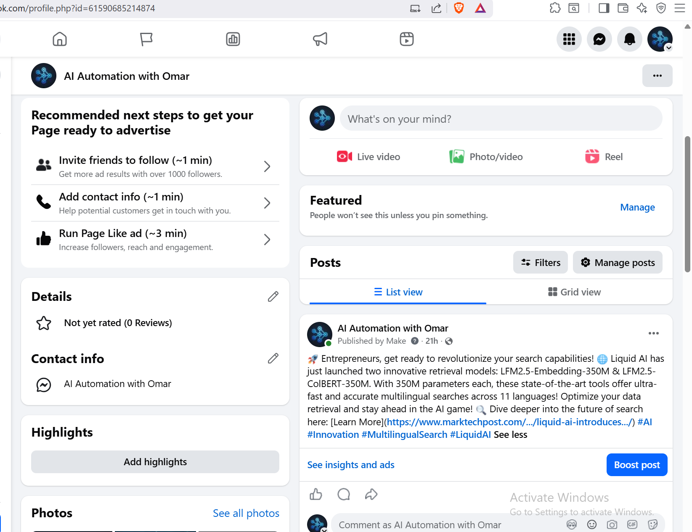
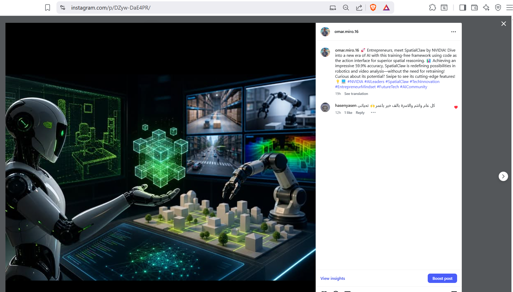
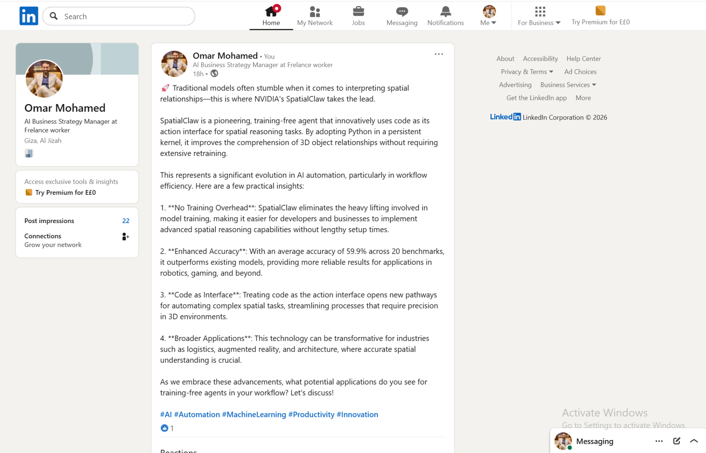

# AI Social Media Automation Machine V1

An AI-powered social media automation workflow that turns RSS feed articles into platform-specific posts for Facebook, Instagram, and LinkedIn using Make.com, OpenAI, Cloudinary, and social media APIs.

---

## Project Overview

This project automates the process of creating and publishing social media content from RSS feed articles.

The workflow monitors an RSS feed, analyzes each new article using OpenAI, generates platform-specific content, creates an AI-generated image for Instagram, uploads the image to Cloudinary, and publishes the final posts to multiple social media platforms.

This project was built as part of my AI Automation portfolio to demonstrate practical skills in workflow automation, AI content generation, API integration, and multi-platform publishing.

---

## Workflow Architecture

```text
RSS Feed
→ OpenAI Content Analysis
→ Router
   → LinkedIn Post Generator → LinkedIn Publishing
   → Facebook Post Generator → Facebook Page Publishing
   → Instagram Caption Generator → AI Image Generation → Cloudinary Upload → Instagram Publishing
```

---

## Tools Used

* Make.com
* OpenAI / ChatGPT
* RSS Feed
* Cloudinary
* HTTP API
* Facebook Pages
* Instagram for Business
* LinkedIn

---

## Key Features

* Watches RSS feed items automatically.
* Uses OpenAI to analyze article content.
* Generates platform-specific posts for:

  * Facebook
  * Instagram
  * LinkedIn
* Creates an AI-generated image for Instagram.
* Uploads the generated image to Cloudinary.
* Uses a public image URL for Instagram publishing.
* Publishes content automatically to multiple platforms.
* Uses a Make.com Router to separate each platform flow.
* Keeps each platform prompt customized for the correct content style.
* - Prevents duplicate publishing using Make Data Store.
* - Logs successful publishing events into Google Sheets.
* - Sends Telegram success notifications after publishing.
* - Handles publishing errors using Make error handlers.
* - Logs failed operations into Google Sheets.
* - Sends Telegram error alerts when a publishing step fails.

---## Project Files

* [Make.com Blueprint](make-blueprint/make-scenario-blueprint.sanitized.json)
* [Facebook Prompt](prompts/facebook-prompt.md)
* [Instagram Prompt](prompts/instagram-prompt.md)
* [LinkedIn Prompt](prompts/linkedin-prompt.md)
* [Image Generation Prompt](prompts/image-generation-prompt.md)
* - [Case Study](case-study.md)

## What Problem This Solves

Creating content manually for multiple platforms takes time.

This automation helps businesses, content creators, and marketers turn articles or RSS updates into ready-to-publish social media posts without manually rewriting the same content for every platform.

It can be useful for:

* AI news pages
* Business blogs
* Marketing teams
* Content creators
* Agencies
* Automation consultants
* Personal branding workflows

---

## Platform-Specific Content Logic

### Facebook

The Facebook branch creates a short, engaging post suitable for a Facebook Page.
The tone is more conversational and designed for quick engagement.

### Instagram

The Instagram branch creates a caption with hashtags, generates a matching AI image, uploads it to Cloudinary, and publishes it as an Instagram photo post.

### LinkedIn

The LinkedIn branch creates a professional post with a strong hook, useful insights, and a soft call-to-action for discussion.

---

## Screenshots

### Make.com Scenario Overview


### Facebook Output



### Instagram Output



### LinkedIn Output


```

---

## Example Use Case

A new article appears in an RSS feed.

The automation:

1. Captures the article title, summary, and URL.
2. Sends the article data to OpenAI.
3. Generates a content strategy and platform-specific outputs.
4. Sends each output to the correct platform branch.
5. Creates an AI image for Instagram.
6. Uploads the image to Cloudinary.
7. Publishes the final posts to Facebook, Instagram, and LinkedIn.

---

## Project Status

Version: V1.1
Completed and tested with logging, notifications, error handling, and duplicate prevention.

Completed features:

* RSS feed trigger
* AI content analysis
* Facebook post generation
* Instagram caption generation
* LinkedIn post generation
* AI image generation
* Cloudinary image upload
* Instagram publishing
* Facebook Page publishing
* LinkedIn publishing

---

## Planned Improvements

Future versions may include:

* Google Sheets logging
* Telegram success notifications
* Error handling
* Duplicate post prevention
* Approval step before publishing
* YouTube video-to-social-content repurposing
* Notion content calendar integration

---

## Portfolio Notes

This project demonstrates practical experience with:

* AI Automation
* Make.com scenario design
* OpenAI prompt engineering
* API integration
* Social media automation
* Content repurposing
* Cloud image hosting
* Multi-platform publishing workflows

---

## Important Security Note

The public blueprint version should not include private API keys, access tokens, connection IDs, or personal account identifiers.

Before importing or sharing the Make.com blueprint, replace private values with placeholders such as:

```text
YOUR_OPENAI_CONNECTION
YOUR_CLOUDINARY_CLOUD_NAME
YOUR_UPLOAD_PRESET
YOUR_FACEBOOK_PAGE_ID
YOUR_INSTAGRAM_ACCOUNT_ID
YOUR_LINKEDIN_ACCOUNT
```

---

## Author

Built by Omar eldakhly as part of an AI Automation portfolio focused on Make.com, OpenAI, no-code automation, and content automation systems.

